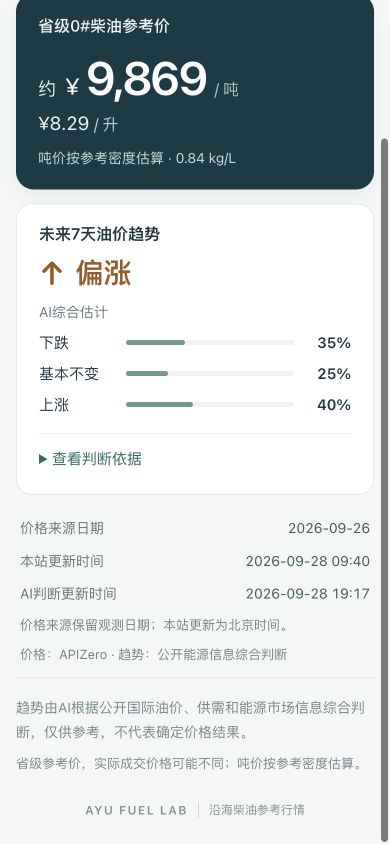

# AYU_FUEL_AUTOMATED_INTELLIGENCE_V2_001

## 最终 Gate（当前候选、本次执行）

```text
INTELLIGENCE_V2_DATA_GATE = PASS
INTELLIGENCE_V2_FORECAST_GATE = PASS
INTELLIGENCE_V2_UI_GATE = PASS
```

Phase A 链路完成，等待候选产品验收。没有合并 main、更新公开 Pages、调用付费模型或进入旧量化研究。PASS 说明本次证据、预测合同和候选交互通过，不证明预测准确率，也不代表免费来源长期稳定。

## 当前真实运行与判断

| 项目 | 本次结果 |
| --- | --- |
| Evidence generatedAt | 2026-09-28T11:15:07.714Z（北京 19:15） |
| Forecast generatedAt | 2026-09-28T11:17:34.176Z（北京 19:17） |
| validUntil | 2026-09-29T11:17:34.176Z，恰好 +24h；来源失效可更早降级 |
| primaryDirection | UP → ↑ 偏涨 |
| DOWN / FLAT / UP | 35% / 25% / 40% |
| probabilityType | AI_SUBJECTIVE_ESTIMATE |
| provider | MANUAL，由当前 Codex 根据被冻结证据包分析 |
| 证据数量 | 7 条、3 个独立事件，不按文章/周报字段累加权重 |
| Tier 1 | 6 条信号、2 个资料入口、1 个发布机构 EIA；现货页注明 Refinitiv 来源 |
| Tier 2 | 1 条风险、1 个 Reuters 文章入口，通过 Business Recorder 原文核实 |
| 当前证据 hash | 66453209e4ab96362b77d9846d91b7cf9dd287adf3a63ef7d7af4013d904e135 |

主要因素：美国馏分油库存减少；Brent 最新日度报价上涨；霍尔木兹供应存在不确定风险。反向证据：纽约港低硫柴油最新日度报价回落。

这是偏向较小的主观判断：柴油自身走弱与库存/原油/运输风险相互冲突；库存、产量、加工量同属一次 EIA 周报，Brent/WTI 同属一次报价快照，不作为六票利多。近期 FRED 序列延迟，不给当前方向权重。没有把风险写成确定停产，也没有机械评分公式或统计模型。

## 来源、时效和缺口

- [EIA 日度公开快照](https://www.eia.gov/todayinenergy/prices.php)：最新可读页面发布日期 2026-09-25，报价观察日 2026-09-24；NY Harbor Low-Sulfur Diesel 日度回落，Brent/WTI 日度上涨。执行时为纽约周一早晨，报价较最近完整工作日有一个工作日发布延迟，按明确的一日延迟规则准入。该页只给发布日期，DATE_ONLY 标记避免虚构精确发布时刻。
- [EIA 最新周报](https://www.eia.gov/petroleum/supply/weekly/) 与 [原文摘要](https://ir.eia.gov/wpsr/summary.txt)：发布 2026-09-23 14:30Z，统计周截止 2026-09-18；库存减少、产量减少、加工量减少，利用率可读取。下一期 2026-09-30 14:30Z。最旧关键观测日为 **09-18**，最旧关键发布为 **09-23**，区别已保留，不能把统计周称为今日。
- [Reuters 当日报道原文](https://www.brecorder.com/news/40441609/indian-shares-slide-to-near-six-month-low-as-us-iran-deadlock-lifts-oil-prices)：发表 2026-09-28 10:44:01Z，byline/正文/时间实际读取；只提取当日报道的持续供应风险，不使用股市、汇率、新闻中的不同期货报价作为柴油事实。
- GDELT 研究探测曾返回 30 条，但最终两次真实采集连接失败；本次使用免费 RSS 备用，检查 30 个候选、读取 4 篇原文，最终只有 1 条新闻风险准入。其他条目不相关或未满足核实规则，没有强行填信号。
- OPEC 官方入口 HTTP 403：OPEC_MAJOR_PRODUCERS = FAILED；没有以旧政策冒充当前政策。DEMAND_MACRO = NO_QUALIFIED_SIGNAL。SHIPPING 引用同一霍尔木兹事件，不增加独立事件数。
- FRED 近期上下文最后日期 09-22，STALE，仅记录检查结果；不冒充最新市场。没有当前 MGO/欧洲亚洲柴油连续报价，第一版明确采用纽约港低硫柴油现货代理。

自动 Source Gate 的可验证边界是来源字段、时效、原文解析、事件归属和完整包 hash；它不能单独证明所有源文章真实或源日期无误。本次同时人工读回官方行情与周报及 Reuters 原文。免费新闻适配器只接纳已支持的保守事件规则，其他事件待核实。

## 架构与定时状态

公开来源 → 有限自动采集 → 来源/时效门禁 → Evidence Pack → MANUAL_PROVIDER → Forecast Gate → 不可覆盖历史 → 候选 forecast-cache → UI。

默认 MANUAL；OPENAI/OTHER 调用前直接阻断，无 SDK、无密钥读取、无计费调用。未来只替换 provider 实现，继续沿用合同、门禁、历史和 UI。

GitHub Actions 配置北京时间 07:30、18:30 收集待分析包，失败也上传诊断；没有自动分析或发布步骤。**配置位于 feature 分支，尚未在默认分支启用定时运行；本轮实际执行证据来自本地自动采集。** 正式判断建议每天 08:00，当前为免费人工/Codex 分析阶段。

## 历史与 Outcome

- [当前不可覆盖快照](data/forecast-history-v2/2026-09-28T11-17-34.176Z-66453209e4ab.json) 保存完整包、hash、概率、主方向、原因、源 URL、generatedAt、validUntil。
- 11:05 的首条工程快照同样保留；其中日度发表时刻曾按发布窗口端点表示，随后补充 DATE_ONLY 并重新采集生成当前快照。没有修改或覆盖首条历史；当前页面仅使用 11:17 快照。
- T+7 Outcome 已实现，首次最早到期为 2026-10-05；本轮没有填任何实际 outcome。结果保存在独立 `.outcome.json`，原预测不变。指标固定为同一 NY Harbor Low-Sulfur Diesel USD/gallon 序列，绝对变化 <0.5% 记 FLAT，之后观察日与延迟明确保留。
- “不可覆盖”是本项目写入接口 exclusive-create 的约束与 Git 历史证据，不是存储服务的 WORM 保证。

## 页面和真实操作

候选预览：[http://127.0.0.1:4410/](http://127.0.0.1:4410/)。本地服务正在运行；公开 main 站未变化。

当前页面：沿海省份选择 → 省级真实 0#参考价（吨价主、升价次、0.84 kg/L）→ 未来7天油价趋势（UP/DOWN 主箭头、AI综合估计、三个百分比）→ 默认收起的判断依据（最多 3/2、来源链接）→ 数据时间 → 指定短说明。没有登录、新闻 feed、后台、量化图表或“震荡”主结论。

实际浏览器验证：390×844、320×740 均看到价格、箭头与三个百分比；320 宽没有横向溢出，三个百分比底部约 572px。全部 11 个沿海地区逐项实际点击，价格分别显示；展开/收起理由；来源点击打开 EIA 正确 URL。临时过期缓存显示“数据更新中”；临时失败缓存显示“当前信息不足，暂不判断”；两次模拟省级价格不变，之后恢复真实候选缓存。浏览器 error 日志为空。



## 测试与保留边界

[完整测试结果](outputs/intelligence-v2/test-results.json)：**123/123 PASS**，其中 V2 21 项；[实际 UI 操作记录](outputs/intelligence-v2/ui-regression.json)。

覆盖用户要求的全部 15 项：自动采集、重复不增权、过期新闻、缺 URL、证据不足、虚构事实、总和、5% 步长、主方向、24h 过期、预测故障隔离、11 地区、吨价、历史不可覆盖、旧研究无法被运行时读取。额外覆盖 hash 篡改、非法时间、周报到期、分类缺失、HTTP/超时、付费 provider 零请求、NA 报价、日期精度及 T+7 侧车不可覆盖。

公开文件扫描 PASS；相对 V5 基线，research/、省级价格采集器、fuel-service.js、price-display.js 无改动。旧研究 V1–V5 和独立 V6 部分笔记冻结保留；候选 app 依赖图和新任务均不读研究输出。旧合同回归仍可离线运行，不重启研究训练/回测。

## 文件与变更原因

| 文件 | 作用 |
| --- | --- |
| [CURRENT_EVIDENCE_V2.json](CURRENT_EVIDENCE_V2.json)、[current-evidence](intelligence-v2/current-evidence.json)、[pending pack](intelligence-v2/pending-intelligence-pack.json) | 本次真实自动采集、七分类检查、事件组、排除项与访问 hash |
| [CURRENT_FORECAST_CANDIDATE_V2.json](CURRENT_FORECAST_CANDIDATE_V2.json)、[Forecast Gate](FORECAST_GATE_V2_RESULT.json)、[forecast-cache](dist/data/forecast-cache.json) | 当前主观估计、质量门禁、候选缓存 |
| [来源规格](INTELLIGENCE_V2_SOURCE_SPEC.md)、[分析协议](ANALYSIS_PROTOCOL_V2.md)、[正式协议](intelligence-v2/ANALYSIS_PROTOCOL.md) | 固定来源、freshness、主观概率和事实引用边界 |
| [自动化架构](AUTOMATION_ARCHITECTURE.md)、[Provider](FORECAST_PROVIDER_INTERFACE.md) | 分清 Phase A 已执行范围与 Phase B 授权边界 |
| scripts/intelligence-v2/{collect,provider,history,run}.mjs | 有限采集、禁止计费、不覆盖历史、校验后写缓存 |
| dist/data/intelligence-v2-{contract,service,view}.js | 同一合同用于写入/读取、浏览器 hash 复核、简单概率与依据 UI |
| dist/app.js、index.html、styles.css | 替换候选趋势入口、文案和最少展示样式，保留价格链 |
| .github/workflows/intelligence-v2-evidence.yml、update-and-deploy.yml | 配置仅证据定时任务；移除候选价格任务中无用途的旧 trend 步骤 |
| package.json、tests/intelligence-v2.test.mjs、tests/intelligence.test.mjs | 新增运行入口、21 项 V2 检查；旧整文件 workflow hash 断言改为保留价格更新/门禁与删除旧 trend 的明确检查 |

## 候选身份、风险与停止点

分支 `feature/automated-intelligence-v2`，基线 `2686f4cfca79d6f3eb66d08edc460d636384df54`。远端公开 main 在本轮前后核验为 `eaeb3ada685099b4fe4d9cb66b6d3a7cc3488908`；候选最终 remote-backed SHA 在交付消息中给出，避免提交文档自引用自己的 commit。没有创建或执行付费资源，阿渔/渔账生产项目未读取或接入。

剩余风险：单一柴油区域代理不等于全球全部柴油市场；免费来源会失联、日期与 HTML 布局可变；OPEC 与宏观信息当前有明确缺口；AI 数值尚未校准、没有准确率证据；Phase A 需要人工/Codex分析，尚无线上定时触发和自动 AI 发布；24h/来源 freshness 失效后候选会降级。

三 Gate 当前均 PASS，下一步是产品 UI 验收与明确上线确认。**本轮至此停止，不合并 main、不更新公开 Pages、不继续量化研究。**
