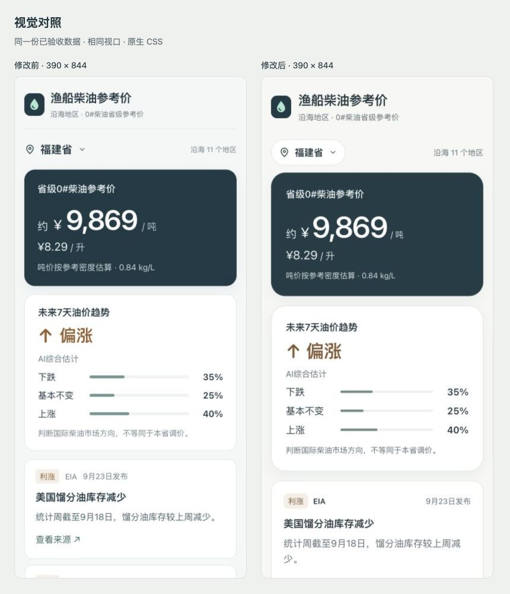

# BEFORE_AFTER_REVIEW

任务：AYU_FUEL_FINAL_UI_POLISH_001  
基线：cdd41ae67188eb4e3e90ddbde0b1c18b618c851f  
数据：同一份已验收油价、Forecast 和 Evidence；各对照均为福建、同一视口、页首静止状态。

## 视觉检查

| 区域 | 本轮变化 | 验收 |
| --- | --- | --- |
| 顶部 / 地区 | 暖中性背景，44px 白色 pill，键盘焦点 | 清楚、无导航扩张 |
| 主价格 | 24px 圆角、适度数字字重、吨价与升价层级、清楚估算说明 | 0.84 kg/L 和价格不变 |
| 趋势 | 24px 圆角、30px 方向结论、16px 三行概率 | 下跌35 / 基本不变25 / 上涨40保持不变 |
| 依据 | 16px 圆角、白底薄边、来源加重、日期右对齐、正文16px | 四张真实卡直接展示，来源链接44px |
| 状态 | 静止骨架、柔和空状态、清楚延迟提示 | 预测失败时价格保持可用 |
| Footer | 两句简短中文、提高对比度 | 时间、价格来源与估算语义保留 |

390px 的第三行概率底部为约607px，320px 为约576px，均在首屏；首张卡分别从约681px、663px出现。更大的正文会增加卡片高度，390px第一条来源链接需要轻微向下滚动。桌面内容列保持640px。

## 真实截图

截图是实际浏览器视口输出。对照页面只排列这些原始截图，没有重绘或生成产品画面。

| 视口 | 修改前 | 修改后 |
| --- | --- | --- |
| 390 × 844 | [before-390.jpg](outputs/final-ui-polish/before-390.jpg) | [after-390.jpg](outputs/final-ui-polish/after-390.jpg) |
| 320 × 740 | [before-320.jpg](outputs/final-ui-polish/before-320.jpg) | [after-320.jpg](outputs/final-ui-polish/after-320.jpg) |
| 1280 × 900 | [before-desktop.jpg](outputs/final-ui-polish/before-desktop.jpg) | [after-desktop.jpg](outputs/final-ui-polish/after-desktop.jpg) |

[查看三个尺寸的并列截图](outputs/final-ui-polish/comparison.html)

## 交互与状态

实际点击11地区：福建、浙江、山东、广东、辽宁、海南、江苏、河北、天津、上海、广西。仅价格变化，趋势与四条依据保持相同；320px最长名称广西完整显示，无横向溢出。

四条来源链接逐条点击，分别打开独立上下文；EIA周报由源站跳转至其secure路径，价格页和报道均加载。返回后价格、趋势保持。查看来源仍使用原始HTTPS链接、noopener noreferrer与原有可访问名称。

预测过期 / 不可用分别在两种手机视口验收，均移除概率和依据，保留价格。另验收价格加载、暂不可用、重新获取恢复、延迟提示。所有异常来自单独本地测试服务，候选缓存和有效期未修改。

## Accessibility与降级

实际DOM文字对比度最低5.05:1；核心控件/来源点击区域至少44px。Enter打开、Tab切换选项、反向Tab到关闭、Enter关闭、Escape关闭与焦点返回、来源焦点圈均已操作。原生dialog在本次WebView中，末项后的Tab可转入浏览器工具栏；未改动既有焦点行为，不宣称完整无障碍认证。

减少动态通过隔离页面激活原有reduce分支验证，transition为0s。无blur通过隔离页面省略可选supports分支验证，selector仍为不透明白底，信息完整。Evidence没有blur。未改变操作系统偏好，未使用真实旧设备验证。

最新用户更正保留直接卡片；标题 / 分组 / 展开 / 收起 / aria-expanded均不恢复，折叠验收为不适用。

## 性能与范围

CSS：14,317 → 16,599字节；gzip：3,762 → 3,994字节（增加232）。活跃JS：35,063字节不变（12个原有模块）；所有dist JS合计57,763字节不变。无新增运行时依赖、字体、图片或远程资源。

本地390px浏览器从导航到价格、概率、四卡可见：首次独立origin 295 → 221ms，重复reload 221/159 → 154/165ms。结果包含工具开销，不能当作真实公网FCP/LCP；本轮没有观察到本地加载退化。

业务保护覆盖1,252个原有文件，全部SHA-256一致。产品差异只有CSS和Footer两句文案；完整现有141项测试通过。
