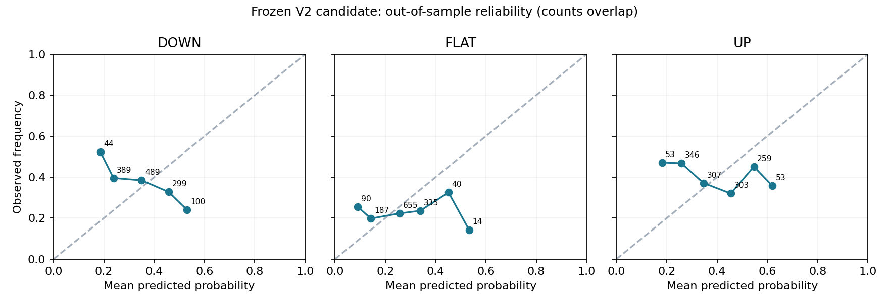

# CALIBRATION_V2

确实在测试前一年的校准集拟合了Platt-style多分类logistic和逐类isotonic；执行过校准不等于校准效果合格。正式候选的classwise平均ECE比历史频率更差。

| 路线 | N | Brier ↓ | Log loss ↓ | ECE ↓ | Accuracy | Macro F1 |
|---|---:|---:|---:|---:|---:|---:|
| frequency | 1321 | 0.671297 | 1.105511 | 0.077265 | 0.2771 | 0.2273 |
| vol_historical_raw | 1321 | 0.652962 | 1.073391 | 0.042097 | 0.3573 | 0.3399 |
| vol_historical_platt | 1321 | 0.698150 | 1.151943 | 0.107973 | 0.3308 | 0.2749 |
| vol_historical_isotonic | 1321 | 0.684404 | 1.310332 | 0.080113 | 0.3656 | 0.3149 |

## 55%—65%概率桶（不是产品当前概率）

| 类别 | 日度重叠N | 平均预测 | 实际发生 | 非重叠N | 平均预测 | 实际发生 |
|---|---:|---:|---:|---:|---:|---:|
| DOWN | 24 | 56.64% | 45.83% | 5 | 56.63% | 40.00% |
| FLAT | 5 | 55.90% | 0.00% | 1 | 55.90% | 0.00% |
| UP | 153 | 58.42% | 43.14% | 27 | 58.57% | 51.85% |

三类非重叠桶都少于事先要求30；不能宣布60%可靠。尤其FLAT只有1个非重叠样本，0%兑现不是精确总体估计。UP重叠153个快照并非153个独立预测事件。

## 各类10个等宽可靠性桶

| 类别 | 概率范围 | N | 平均预测 | 实际发生 |
|---|---|---:|---:|---:|
| DOWN | 0.0—0.1 | 0 | — | — |
| DOWN | 0.1—0.2 | 44 | 18.62% | 52.27% |
| DOWN | 0.2—0.3 | 389 | 23.82% | 39.59% |
| DOWN | 0.3—0.4 | 489 | 35.01% | 38.45% |
| DOWN | 0.4—0.5 | 299 | 45.74% | 32.78% |
| DOWN | 0.5—0.6 | 100 | 53.09% | 24.00% |
| DOWN | 0.6—0.7 | 0 | — | — |
| DOWN | 0.7—0.8 | 0 | — | — |
| DOWN | 0.8—0.9 | 0 | — | — |
| DOWN | 0.9—1.0 | 0 | — | — |
| FLAT | 0.0—0.1 | 90 | 9.03% | 25.56% |
| FLAT | 0.1—0.2 | 187 | 14.26% | 19.79% |
| FLAT | 0.2—0.3 | 655 | 25.65% | 22.29% |
| FLAT | 0.3—0.4 | 335 | 33.89% | 23.58% |
| FLAT | 0.4—0.5 | 40 | 45.12% | 32.50% |
| FLAT | 0.5—0.6 | 14 | 53.28% | 14.29% |
| FLAT | 0.6—0.7 | 0 | — | — |
| FLAT | 0.7—0.8 | 0 | — | — |
| FLAT | 0.8—0.9 | 0 | — | — |
| FLAT | 0.9—1.0 | 0 | — | — |
| UP | 0.0—0.1 | 0 | — | — |
| UP | 0.1—0.2 | 53 | 18.11% | 47.17% |
| UP | 0.2—0.3 | 346 | 25.80% | 46.82% |
| UP | 0.3—0.4 | 307 | 34.64% | 37.13% |
| UP | 0.4—0.5 | 303 | 45.45% | 32.01% |
| UP | 0.5—0.6 | 259 | 54.65% | 45.17% |
| UP | 0.6—0.7 | 53 | 61.91% | 35.85% |
| UP | 0.7—0.8 | 0 | — | — |
| UP | 0.8—0.9 | 0 | — | — |
| UP | 0.9—1.0 | 0 | — | — |

点旁N为重叠快照数。图和桶用于描述，不提供假设样本独立的误差棒。正式Gate另外使用非重叠60%桶与时间块区间。
