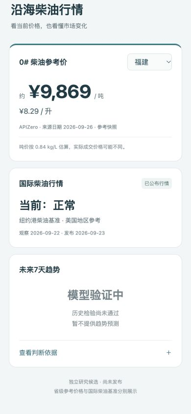

# TEST_RESULTS

审查日2026-09-28；数据快照冻结在北京时间00:00。证据级别为本地研究和浏览器候选，未作公开发布。

| 检查 | 结果 | 原始证据 |
|---|---|---|
| 既有Node回归 | 102 / 102 PASS | `node-regression.txt` |
| V2显示合同 | 7 / 7 PASS | `node-v2-tests.txt` |
| V2科学计算/时间边界 | 19 / 19 PASS | `python-v2-tests.txt` |
| 全流程复跑 | 2次一致；7个关键文件SHA256相同 | `reproducibility.json`、`rerun-log.txt` |
| 公共文件扫描 | PASS，无敏感项 | `public-scan.json` |
| 手机版实际交互 | PASS | `browser-evidence.json`、两张截图 |
| 模型有效性 | **FAIL**，不可与代码测试通过混淆 | `../data/backtest-results.json` |

## Python覆盖的具体风险

美国日期/夏令时的发布可获得时间；节假日向后顺延端点；过长缺口及未知终点拒绝；FLAT边界；柴油收益公式及禁止把label当特征；改变未公布价格不影响特征；改变验证/测试收益不影响阈值；全部9个设计/测试fold的标签发布和端点purge；实际端点非重叠；经验CDF边界；5条路线都不读取查询标签；两种校准归一化；评分/空概率桶；异常发布日期隔离；所有快照availability；同日42加仑/桶crack；负价/过期窗口；Gate失败没有当前预测及制品；下载manifest不能被不同快照静默替换。

## Node覆盖的显示风险

Gate FAIL阻断即使格式有效的合同；无合同/NaN/Infinity/字符串/负概率拒绝；概率和/错误源/未校准/方向冲突拒绝；未来或过期合同拒绝；最大余数法合计100；实际FAIL文件无概率；当前状态到期、无有效数据降级。合成值仅存在TEST_ONLY测试夹具，未写入候选UI。

## 实际浏览器验证

- 390×844首屏：省级参考价格、纽约港地区及观察/发布日期、未来7天“模型验证中”清楚显示。
- 320×740：document宽度320，scrollWidth320；展开完整判断依据也无横向溢出。
- 11沿海地区逐一真实切换；福建8.29元/升、浙江8.28、辽宁8.19，与候选快照一致。其它8地区结果见browser-evidence.json。
- 实际展开/收起判断依据：20个已公布报价图、Brent历史变化、库存及炼厂“未纳入”、外域限制和研究链接正常显示。
- 首屏和展开详情均无百分号；没有模型FAIL时的箭头方向/概率。浏览器warning/error记录为0。
- 临时viewport已恢复；保留V2交付标签。旧候选服务未停止、旧页面未编辑。

## 隔离

相对候选基线44ad784，新增/修改路径全部在 `research/global-diesel-v2/`。`dist/`、`intelligence/`、`.github/`、`package.json` diff为空。新分支push不会匹配现有仅main部署的push触发器；没有发起workflow dispatch。

远端SHA、main前后回读、工作树clean状态由任务交付清单最终记录。研究Gate失败即停止模型制品/当前预测输出，不作上线验收。
