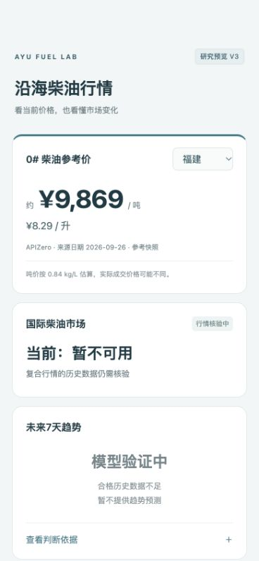

# V3 候选浏览器验证

候选：[本地页面](http://127.0.0.1:4404/research/global-diesel-v3/ui/)。只检验独立 V3 候选，未操作公开网站。

## 实际操作

- 打开原生省份菜单，点击浙江，观察 ¥8.28 / 升、约 ¥9,857 / 吨。
- 通过页面选择控件逐一切换 11 个沿海地区，核对可见价格和失败状态；明细在 [browser-verification.json](browser-verification.json)。
- 展开“查看判断依据”，核对数据回修、发布时间与 MGO 代表性限制说明；另以键盘 Enter 实际展开及收起，状态均确认。
- 手机宽度 390 像素下，页面 scrollWidth 为 390，无横向溢出；全文没有百分比，国际市场为“当前：暂不可用”，未来7天为“模型验证中”。
- 浏览器未记录 JavaScript error。结束时恢复正常预览尺寸、收起依据并保留福建候选页。

| 地区 | 约元/吨 | 元/升 |
|---|---:|---:|
| 福建 | 9869 | 8.29 |
| 浙江 | 9857 | 8.28 |
| 广东 | 9893 | 8.31 |
| 山东 | 9774 | 8.21 |
| 辽宁 | 9750 | 8.19 |
| 河北 | 9893 | 8.31 |
| 天津 | 9893 | 8.31 |
| 上海 | 9857 | 8.28 |
| 江苏 | 9833 | 8.26 |
| 广西 | 9952 | 8.36 |
| 海南 | 9988 | 8.39 |

上述均为 APIZero 来源日期 2026-09-26 的固定省级参考价快照；吨价按 0.84 kg/L 估算，不是实时成交价。国际状态与未来预测未被价格快照替代。

## 可见证据

截图为浏览器原始 viewport capture，未编辑。手机宽度截图和正常预览截图使用实际 JPEG 格式；页面全长截图的捕获缩放异常不作为验收证据。

[正常预览截图](candidate-preview-v3.jpg)。

## 验证范围

本地交互与失败产品状态已经验证。这不是正式模型验收或公开网站发布证明；没有合格预测 Target，因此没有概率或模型评分可以验收。
