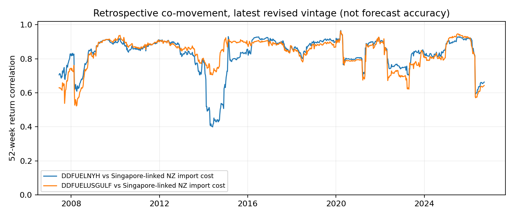

# Composite Validity：同期诊断

**PROMISING_RETROSPECTIVE_PROXY_ONLY；正式 Composite 仍 NOT_ADMITTED。**

数据为最新修订价格；用途仅检查共同波动，不作可得时间合格的预测评价。2006-06-23–2026-09-18，1057 个共同周收益。

| 配对 | 周收益 n | Pearson r | 同期方向一致 | 52周滚动中位数 | 52周滚动范围 |
| --- | --- | --- | --- | --- | --- |
| DDFUELNYH vs SG-linked NZ import proxy | 1057 | 0.762651 | 82.02% (n=1057) | 0.852403 | 0.399313–0.966145 |
| DDFUELUSGULF vs SG-linked NZ import proxy | 1057 | 0.752060 | 82.67% (n=1056) | 0.867018 | 0.522601–0.963152 |

## 1日 / 7日的不同含义

| 配对 / 窗口 | n | 相关性 |
| --- | --- | --- |
| NYH vs USGC，真实相邻自然日 | 3977 | 0.88992847 |
| NYH vs USGC，精确7自然日 | 4890 | 0.92455551 |
| US vs MBIE，1自然日 | 不可计算 | null：源是周度 |
| US vs MBIE，7日周均变动 | 1057 | 见上表 |

US 日度计算只配对实际观察值，周末/休市缺口不填价格。跨地区诊断将 US 的真实报价取 W-FRI 周均值（每周至少3个实际值），与 MBIE 周五标记的周数据合并。计算相邻7日周均值的 log return；不声称它是周五 close 到下一周五 close。USD/gal 与 USD/L 不加总价格水平。

MBIE 转换：`NZD cents/L × USD/NZD / 100 = USD/L`，汇率来自同一公开表。未还原 Argus 原始 spot。完整周网格保留，缺周不会被当成相邻7日；无 forward-fill、插值或长时间重复周价。方向比较剔除绝对 log return ≤1e-12 的零变动，并单独给出 n。52周滚动窗口只向后看同期收益。

## 可以和不可以得出的结论

非美国成本 proxy 与美国柴油有明显同期共同移动；因此不能说“非美国没有数据”或“区域长期互不相关”。但约82%的同期方向一致不是未来7日预测准确率，相关性不证明先行预测信息、模型增量或概率校准。

缺欧洲、缺直接亚洲 MGO、缺非美国长期 PIT vintage，使全球/船燃代表性及无泄漏训练仍未成立。本轮未建立正式 Global Diesel Composite；没有用两条高度相关的美国腿掩盖缺少其它区域的问题。MGO 的独立相关性、未来方向与 Brier 仍 N/A。
