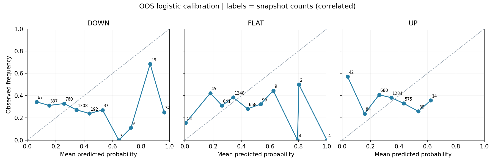

# Calibration report

只用过去校准年。候选为多分类Logistic/Platt式校准；Isotonic按类拟合再归一化，只作比较。所有以下数字来自OOS；已执行校准不代表校准成功。

| 模型 | N | Brier↓ | Log loss↓ | 平均classwise ECE↓ | Accuracy | Macro F1 |
|---|---|---|---|---|---|---|
| logistic_raw | 2768 | 0.677303 | 1.175191 | 0.053978 | 0.369581 | 0.357091 |
| logistic_calibrated | 2768 | 0.711392 | 1.201528 | 0.097476 | 0.294436 | 0.289719 |
| isotonic_diagnostic | 2768 | 0.696004 | 1.387322 | 0.079549 | 0.309249 | 0.299284 |

候选每类ECE：{'DOWN': 0.11067384700711386, 'FLAT': 0.08675787288477602, 'UP': 0.09499503917580725}。分桶为左闭右开，最后一桶含1；没有样本的桶不可验证。每天样本相关，不将桶计数视为独立试验数。

## 完整分桶

| 类别 | 预测区间 | N | 平均预测 | 实际发生 | 绝对偏差 |
|---|---|---|---|---|---|
| DOWN | 0–10% | 67 | 6.49% | 34.33% | 27.84% |
| DOWN | 10–20% | 337 | 15.40% | 31.16% | 15.76% |
| DOWN | 20–30% | 760 | 25.86% | 32.89% | 7.03% |
| DOWN | 30–40% | 1308 | 34.59% | 27.14% | 7.45% |
| DOWN | 40–50% | 192 | 43.70% | 23.96% | 19.74% |
| DOWN | 50–60% | 37 | 52.93% | 27.03% | 25.90% |
| DOWN | 60–70% | 7 | 64.35% | 0.00% | 64.35% |
| DOWN | 70–80% | 9 | 72.91% | 11.11% | 61.80% |
| DOWN | 80–90% | 19 | 86.39% | 68.42% | 17.97% |
| DOWN | 90–100% | 32 | 96.20% | 25.00% | 71.20% |
| FLAT | 0–10% | 58 | 0.71% | 15.52% | 14.80% |
| FLAT | 10–20% | 45 | 17.97% | 42.22% | 24.25% |
| FLAT | 20–30% | 641 | 26.23% | 31.05% | 4.82% |
| FLAT | 30–40% | 1248 | 34.12% | 38.38% | 4.26% |
| FLAT | 40–50% | 658 | 44.27% | 28.12% | 16.16% |
| FLAT | 50–60% | 99 | 53.39% | 32.32% | 21.06% |
| FLAT | 60–70% | 9 | 62.27% | 44.44% | 17.82% |
| FLAT | 70–80% | 4 | 79.33% | 0.00% | 79.33% |
| FLAT | 80–90% | 2 | 80.32% | 50.00% | 30.32% |
| FLAT | 90–100% | 4 | 100.00% | 0.00% | 100.00% |
| UP | 0–10% | 42 | 3.81% | 57.14% | 53.33% |
| UP | 10–20% | 84 | 15.79% | 23.81% | 8.02% |
| UP | 20–30% | 680 | 26.03% | 40.74% | 14.71% |
| UP | 30–40% | 1284 | 34.52% | 38.16% | 3.64% |
| UP | 40–50% | 575 | 43.23% | 33.04% | 10.19% |
| UP | 50–60% | 89 | 53.62% | 25.84% | 27.78% |
| UP | 60–70% | 14 | 62.29% | 35.71% | 26.58% |
| UP | 70–80% | 0 | — | — | — |
| UP | 80–90% | 0 | — | — | — |
| UP | 90–100% | 0 | — | — | — |

## “约60%是否兑现”

以下是55%—65%预测带内实际结果，不代表精确60%的通用保证，也不据此重新调参。

| 类别 | N | 平均预测 | 实际发生 |
|---|---|---|---|
| DOWN | 11 | 58.57% | 27.27% |
| FLAT | 36 | 58.73% | 41.67% |
| UP | 35 | 59.74% | 25.71% |

## 分类表现（仅诊断，不替代概率得分）

| 类别 | 实际N | argmax N | Precision | Recall | F1 |
|---|---|---|---|---|---|
| DOWN | 811 | 806 | 0.2295 | 0.2281 | 0.2288 |
| FLAT | 928 | 1116 | 0.3217 | 0.3869 | 0.3513 |
| UP | 1029 | 846 | 0.3203 | 0.2634 | 0.2891 |

混淆矩阵：行实际、列预测，顺序均DOWN/FLAT/UP。

| 实际 / 预测 | DOWN | FLAT | UP |
|---|---|---|---|
| DOWN | 185 | 331 | 295 |
| FLAT | 289 | 359 | 280 |
| UP | 332 | 426 | 271 |

结论：Gate=FAIL。即便个别概率桶接近兑现比例，也不足以覆盖跨年份失效、类塌缩或整体proper-score退步。
